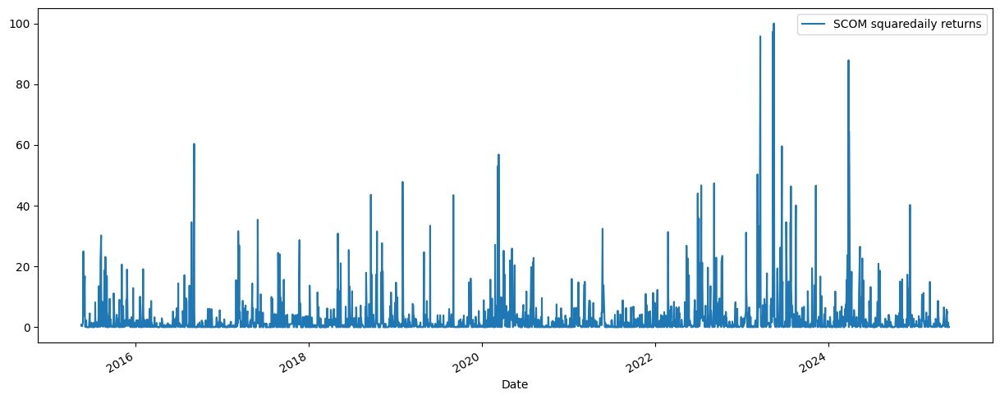

# SCOM-volatility-forecasting
A GARCH model to predict future volatility of Safaricom shares using 10 years historical data.
#project Objectives
If you have ever analyzed stock returns you would notice that periods of high volatility are usually followed by periods of high volatility, and periods of low volatility followed by more periods of low volatility(data exhibits volatility clustering).This common characteristic of financial markets can only be best addressed by time-varying models such as GARCH and ARCH, unlike traditional ARIMA models which assume constant variance. Below is a visualization of the squared daily returns of SCOM,  illustrating volatility clustering:

  

This project therefore does the following:
- ✅ Data ingestion from SQLite DB
- ✅ Exploratory analysis: returns distribution, volatility plots
- ✅ Autocorrelation checks
- ✅ Fitting the data into a Garch(1,1)- optimal model
- ✅ Walk Foward Validation to evaluate how the model performs on test data
- ✅ 10-
