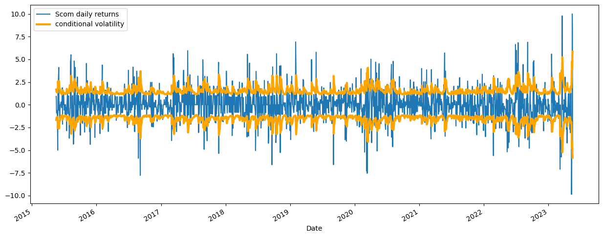
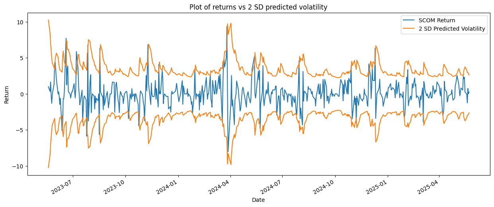

# SCOM-volatility-forecasting
A GARCH model to predict future volatility of Safaricom shares using 10 years historical data. 

# Installation and Setup
To install dependencies run:

 `pip install -r requirements.txt`

# Objectives

If you have ever analyzed stock returns you would notice that periods of high volatility are usually followed by periods of high volatility, and periods of low volatility followed by more periods of low volatility(data exhibits volatility clustering).This common characteristic of financial markets can only be best addressed by time-varying models such as GARCH and ARCH, unlike traditional ARIMA models which assume constant variance. Below is a visualization of the squared daily returns of SCOM,  illustrating volatility clustering:

  

This project therefore does the following: 
- ✅ Data ingestion from SQLite DB
- ✅ Exploratory analysis: returns distribution, volatility plots
- ✅ Autocorrelation checks
- ✅ Fitting the data into a Garch(1,1)- optimal model
- ✅ Model residual diagnostics
- ✅ Walk Foward Validation to evaluate how the model performs on test data
- ✅ 10-day volatility predictions
# Data
## Data Source 
The kind of data we are working with is daily OHLCV of SCOM - stock symbol for Safaricom. Safaricom PLC is a Kenyan based telecommunication company that deals in provision of telecommunication services. I sourced the data from [marketwatch](https://www.marketwatch.com/investing/stock/scom/download-data?countrycode=ke). The site does not allow you to download OHLCV historical data more than a range of one year in a single click. But you can keep downloading the data as multiple times as the range you need- it is the reason I actually have 10 separate CSV files in the data directory each representing data for a year.
## Data Preprocessing 
I chose to store the CSV files in SQLite database. For no reason in particular-maybe because I think databases are built to do what exactly you are needing. You could just still work comfortably with the CSVs though.

# Code Structure

├── data

├── db

├── Img

├── main.py

├── notebooks

├── README.md

├── requirements.txt

├── scripts  

└── src

# Results and Evaluation

Garch(1,1) was the optimal model to fit into our data since all its coefficient were statistically siginificant(had their p-values less than 0.05).

**Perfomance on training data**
    
A plot of returns vs predictions shows that the model does a fairly good job at capturing volatility clustering i.e periods of high and low volatility.

  

**Perfomance on test data**
    
Model evaluation on the test data by perfoming Walk-Foward-Validation shows that it  is performing well on the test data and is capturing periods of high and low volatilty which is evident on 2024-04(high volatilty) and early 2024(low volatility). Note that the conditional volatility is 2 standard deviations away from its original plot.

  

**10-day volatility forecast** 

2025-05-23    1.318274  
2025-05-26    1.391033  
2025-05-27    1.450054  
2025-05-28    1.498431  
2025-05-29    1.538386  
2025-05-30    1.571574  
2025-06-02    1.599263  
2025-06-03    1.622444  
2025-06-04    1.641906  
2025-06-05    1.658281  
Freq: B, Name: predicted_volatility, dtype: float64

# Future Work

Add plotly dash app to the project for better communication of the results and interactive plots.

##  Author

Justoo — Junior Quant / Data Scientist / Actuarial Analyst  exploring quantitative modeling in financial markets.
